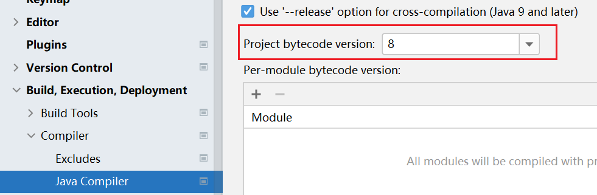

# Linux 性能监控工具

## 工具

+ top

+ htop

+ iostat + watch

+ [dstat](/dstat/dstat.md)

+ [nmon](/nmon/nmon.md)

+ [Grafana + Prometheus + NodeExporter](https://github.com/zhouhuajian-course/linux-monitor-platform)

+ [SkyWalking](/skywalking/skywalking.md) 

## 接口

+ http://192.168.1.103:8080/user/login?user=zhouhuajian&pwd=123456  
  {"code":0,"message":"登录成功","data":null}

+ http://localhost:8080/account/transfer?to=2&amount=100.00  
  {"code":0,"message":"转账成功","data":{"uid":1,"amount":100.0,"to":2}}

## 备注

+ CentOS 安装文件上传下载工具   
  yum update  
  yum install lrzsz -y

+ Jmeter 样本结果默认编码改为UTF-8  
  jmeter.properties  
  ```properties
  # The encoding to be used if none is provided (default ISO-8859-1)
  #sampleresult.default.encoding=ISO-8859-1
  sampleresult.default.encoding=UTF-8
  ```
  
+ if occur `org.springframework.boot:spring-boot-gradle-plugin:3.0.1`  
  把build.gradle的plugins修改下  
  // id 'org.springframework.boot' version '3.0.1'  
  id 'org.springframework.boot' version '2.4.5'  
  https://mvnrepository.com/artifact/org.springframework.boot/spring-boot-gradle-plugin

+  如果编译时出现版本错误  
   Compiler -> Java Compiler -> Project bytecode version 修改下  
  

+ 如果出现中文乱码  
  Settings -> Editor -> File Encodings -> Project Encoding  
  改为UTF-8

+ gradle compileJava 乱码  
  错误: 编码 GBK 的不可映射字符
  https://docs.gradle.org/current/dsl/org.gradle.api.tasks.compile.CompileOptions.html#org.gradle.api.tasks.compile.CompileOptions:encoding  
  ```
  tasks.withType(JavaCompile) {  
      options.encoding = 'UTF-8'
  }
  ```