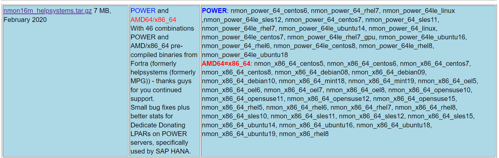
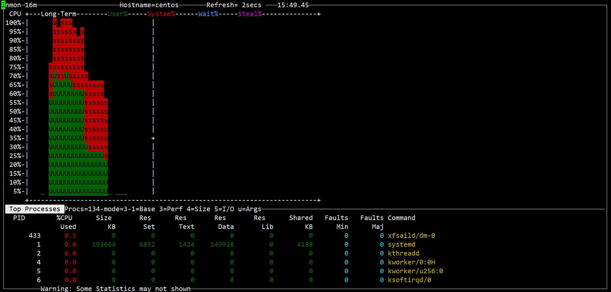
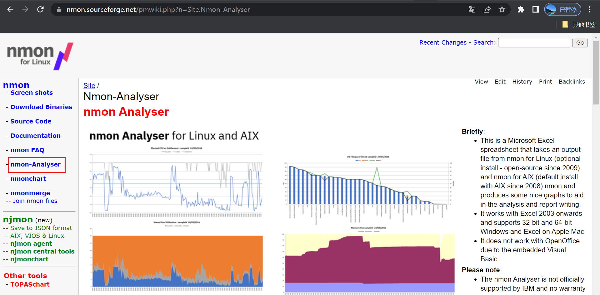
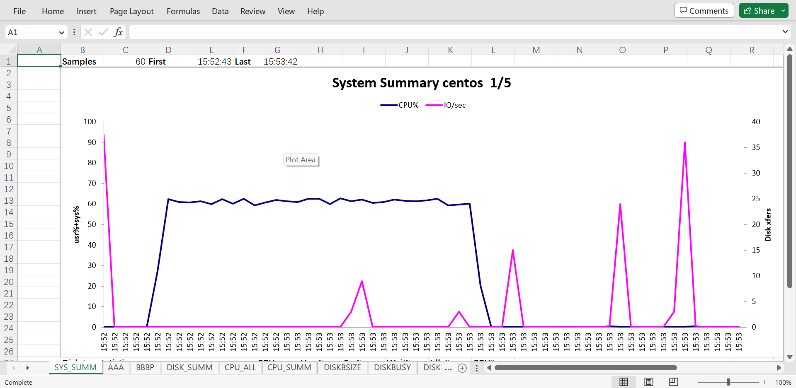

# nmon

## 文档

https://nmon.sourceforge.net/

## 下载nmon并调试

不同操作系统对应不同的binary



`cp nmon_x86_64_centos7 /usr/local/bin/nmon`

```shell
查看系统信息

[root@centos /]# cat /etc/os-release 
NAME="CentOS Linux"
VERSION="7 (Core)"
ID="centos"
ID_LIKE="rhel fedora"
VERSION_ID="7"
PRETTY_NAME="CentOS Linux 7 (Core)"
ANSI_COLOR="0;31"
CPE_NAME="cpe:/o:centos:centos:7"
HOME_URL="https://www.centos.org/"
BUG_REPORT_URL="https://bugs.centos.org/"

CENTOS_MANTISBT_PROJECT="CentOS-7"
CENTOS_MANTISBT_PROJECT_VERSION="7"
REDHAT_SUPPORT_PRODUCT="centos"
REDHAT_SUPPORT_PRODUCT_VERSION="7"

[root@centos /]# lsb_release -a
-bash: lsb_release: command not found
[root@centos /]# hostnamectl 
   Static hostname: centos
         Icon name: computer-vm
           Chassis: vm
        Machine ID: 403a68ecaa2a48258a9ad9c93e72b294
           Boot ID: f2511391c3ad4a85b6731002ccc846c5
    Virtualization: vmware
  Operating System: CentOS Linux 7 (Core)
       CPE OS Name: cpe:/o:centos:centos:7
            Kernel: Linux 3.10.0-1160.81.1.el7.x86_64
      Architecture: x86-64
[root@centos /]# uname -r
3.10.0-1160.81.1.el7.x86_64
```

### 交互模式

`nmon`

按不同的键 可以toggle不同的监控面板，按 q 退出。



### 数据收集模式

`nmon -f -s 1 -c 60 -m 目录`

## 下载nmon-analyser并调试



文件 右键 属性 -> 解除锁定 

点击"Enable Content"


